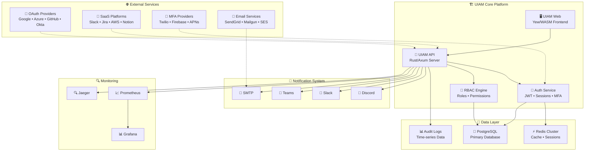

# UIAM Platform

> Universal Identity and Access Management Platform built with Rust

A modern, enterprise-grade identity and access management solution providing authentication, authorization (RBAC), OAuth integrations, and SaaS connectivity.

## 🏗️ Architecture Overview


## 🔄 Authentication Flow


## 🔧 Integration Flow


> **Note**: All diagrams are stored as SVG files in [`docs/images/`](docs/images/) for version control and easy viewing.

## 🚀 Quick Start

### Prerequisites

**Core Requirements:**
- Rust 1.70+ (with wasm32 target for frontend)
- PostgreSQL 13+ (with extensions: uuid-ossp, pgcrypto)
- Node.js 18+ (for documentation and build tools)

**Infrastructure Services:**
- Redis 6+ (for caching and session storage)
- Docker & Docker Compose (for containerized services)

**Development Tools:**
- `trunk` (for WASM frontend builds)
- `sqlx-cli` (for database migrations)
- `cargo-watch` (for hot reloading during development)

**External Service Accounts (Optional):**
- SMTP provider (SendGrid, Mailgun, or MailHog for testing)
- SMS provider (Twilio for production MFA)
- OAuth applications (Google, GitHub, Azure, Okta)
- Monitoring services (Prometheus, Grafana)

### Development Setup

```bash
# Clone repository
git clone <repository-url>
cd uiam-platform

# Install dependencies
cargo build

# Setup database
createdb uiam_dev
psql uiam_dev < migrations/20240101000001_initial_schema.sql

# Configure environment
cp config/development.toml config/local.toml
# Edit config/local.toml with your settings

# Start services
./scripts/start_local.sh
```

### Docker Setup

```bash
# Development environment
docker-compose up -d

# Production environment  
docker-compose -f docker-compose.production.yml up -d
```

## 📊 Project Structure

```
uiam-platform/
├── crates/                 # Rust workspace crates
│   ├── uiam-api/           # HTTP API server (Axum)
│   ├── uiam-web/           # Web UI (Yew + WASM)
│   ├── uiam-auth/          # Authentication service
│   ├── uiam-rbac/          # Role-based access control
│   ├── uiam-integrations/  # OAuth & SaaS integrations
│   ├── uiam-db/            # Database models & queries
│   ├── uiam-config/        # Configuration management
│   └── uiam-cli/           # Command-line interface
├── uiam-docs/              # Documentation (Docusaurus)
├── config/                 # Environment configurations
├── migrations/             # Database migrations
└── scripts/                # Development & deployment scripts
```

## 🔑 Key Features

- **🔐 Multi-factor Authentication**: TOTP, SMS, Push notifications, WebAuthn, Email, Backup codes
- **👥 Role-Based Access Control**: Fine-grained permissions and policies with dynamic enforcement
- **🔗 OAuth Integration**: Google, GitHub, Azure AD, Okta with real-time synchronization
- **🏢 SaaS Connectivity**: Slack, Jira, AWS IAM, Notion with bidirectional user sync
- **📊 Admin Dashboard**: User management, audit logs, analytics with real-time metrics
- **🔍 Audit Logging**: Comprehensive activity tracking with forensic capabilities
- **⚡ High Performance**: Rust-powered backend with WASM frontend and Redis caching
- **🐳 Docker Ready**: Production-ready containerization with orchestration support

## 🌐 Integration Ecosystem

UIAM deeply integrates with a comprehensive ecosystem of enterprise services and platforms:

### 🔐 OAuth Providers
| Provider | Status | Features | User Sync | Admin API |
|----------|--------|----------|-----------|-----------|
| **Google Workspace** | ✅ Production | OAuth 2.0, Admin SDK | ✅ Bidirectional | ✅ Directory API |
| **Microsoft Azure AD** | ✅ Production | OAuth 2.0, Graph API | ✅ Bidirectional | ✅ Admin Portal |
| **GitHub Enterprise** | ✅ Production | OAuth Apps, SAML | ✅ Organizations | ✅ Enterprise API |
| **Okta** | ✅ Production | OIDC, SAML 2.0 | ✅ Real-time | ✅ Admin API |

### 🏢 SaaS Platform Integrations
| Platform | Type | Capabilities | Webhook Support | API Version |
|----------|------|--------------|-----------------|-------------|
| **Slack** | Communication | User provisioning, workspace sync | ✅ Events API | v1.7+ |
| **Jira** | Project Management | User sync, permission mapping | ✅ Webhooks | REST v3 |
| **AWS IAM** | Cloud Security | Role federation, policy sync | ✅ CloudTrail | IAM v1 |
| **Notion** | Collaboration | Workspace integration, user sync | ✅ API v1 | v2023-06-15 |

### 📱 MFA & Authentication Providers
| Method | Provider | Integration | Recovery Options |
|--------|----------|-------------|------------------|
| **TOTP** | Google Authenticator, Authy | RFC 6238 | ✅ Backup codes |
| **SMS** | Twilio, AWS SNS | REST API | ✅ Voice fallback |
| **Push** | Firebase, APNs | Native mobile | ✅ Device trust |
| **WebAuthn** | Platform authenticators | FIDO2/WebAuthn | ✅ Multiple devices |
| **Email** | SMTP providers | Template-based | ✅ Alternative email |

## 🏗️ Infrastructure Services

UIAM's complex architecture leverages multiple infrastructure services for enterprise-grade performance:

### 💾 Database Layer
- **Primary Database**: PostgreSQL 13+ with advanced partitioning
- **Connection Pooling**: PgBouncer with intelligent load balancing  
- **Read Replicas**: Multi-region read scaling
- **Migrations**: Versioned schema management with rollback support

### ⚡ Caching & Performance
- **Redis Cluster**: Multi-node caching with sentinel failover
- **Memory Caching**: In-process L1 cache with intelligent invalidation
- **CDN Integration**: Static asset optimization and global distribution
- **Session Store**: Distributed session management with Redis

### 📧 Communication Infrastructure
| Service | Purpose | Provider Options | Delivery Features |
|---------|---------|------------------|-------------------|
| **SMTP Email** | Transactional emails | SendGrid, Mailgun, SES | Templates, tracking, analytics |
| **Webhooks** | Real-time notifications | Custom endpoints | Retry logic, signing |
| **SMS Gateway** | MFA & notifications | Twilio, AWS SNS | Global delivery, fallback |
| **Push Notifications** | Mobile alerts | Firebase, APNs | Targeted campaigns |

### 📢 Notification Channels
| Channel | Purpose | Integration | Features |
|---------|---------|-------------|----------|
| **Discord** | Team notifications | Webhook API | Rich embeds, role mentions |
| **Slack** | Workspace alerts | Bot API, Webhooks | Interactive messages, threads |
| **Microsoft Teams** | Enterprise notifications | Graph API | Adaptive cards, mentions |
| **Email Templates** | Transactional & alerts | SMTP, Template engines | HTML/text, tracking |

### 🔍 Monitoring & Observability
- **Metrics Collection**: Prometheus with custom metrics
- **Log Aggregation**: Structured logging with correlation IDs
- **Distributed Tracing**: Request flow tracking across services
- **Health Checks**: Comprehensive service monitoring with alerting

### 🛡️ Security Infrastructure
- **TLS Termination**: Advanced certificate management
- **Rate Limiting**: Intelligent DDoS protection and abuse prevention
- **Audit Trail**: Immutable activity logging with forensic capabilities
- **Secrets Management**: Encrypted configuration with rotation

## 🔄 Complex System Interconnections

UIAM's architecture demonstrates deep system integration across multiple dimensions:

### 🌊 Complex Integration Architecture

The following diagram illustrates UIAM's deeply interconnected architecture with external services, core platform components, and infrastructure layers:



### 🔐 Security Layer Integration
- **Multi-layered Authentication**: OAuth → MFA → Session → Authorization
- **Cross-platform Session Management**: Shared sessions across all integrations
- **Real-time Permission Propagation**: Changes sync across all connected systems
- **Centralized Audit**: All actions logged regardless of originating system

### 📊 Real-time Synchronization
- **Bidirectional User Sync**: Changes propagate to/from all connected systems
- **Event-driven Architecture**: Webhook-based real-time updates
- **Conflict Resolution**: Intelligent merge strategies for concurrent updates
- **Batch Processing**: Efficient bulk operations with progress tracking

## 📚 Documentation

For comprehensive documentation including API references, deployment guides, and integration tutorials:

**📖 [View Full Documentation](./uiam-docs/)**

### Quick Links
- [Architecture Details](./uiam-docs/docs/architecture/overview.md)
- [API Reference](./uiam-docs/docs/api/overview.md)  
- [OAuth Setup Guide](./uiam-docs/docs/authentication/oauth-flow.md)
- [SaaS Integration Guide](./uiam-docs/docs/integrations/saas-flow.md)
- [Deployment Guide](./uiam-docs/docs/deployment/)

### Development Documentation
- [Backend Architecture](./uiam-docs/docs/architecture/backend.md)
- [Frontend Architecture](./uiam-docs/docs/architecture/frontend.md)
- [RBAC System](./uiam-docs/docs/architecture/rbac.md)

## 🧪 Testing

```bash
# Run all tests
cargo test

# Test specific crate
cargo test -p uiam-api

# Integration tests
cargo test --test integration_test
```

## 📦 Deployment

### Production Deployment

UIAM requires a sophisticated production infrastructure due to its complex service architecture:

```bash
# Build release binaries for all services
cargo build --release --workspace

# Deploy full infrastructure stack
./scripts/start_production.sh
```

**Infrastructure Components:**
```yaml
# docker-compose.production.yml
services:
  # Core Application Services
  uiam-api:          # REST API server (Rust/Axum)
  uiam-web:          # Frontend app (Yew/WASM)
  
  # Database Layer
  postgres:          # Primary database with replication
  postgres-replica:  # Read replica for scaling
  pgbouncer:         # Connection pooling
  
  # Caching & Session Layer  
  redis-sentinel:    # Redis cluster with sentinel
  redis-master:      # Primary cache node
  redis-replica:     # Cache replica nodes
  
  # Message Queue & Processing
  webhook-processor: # Async webhook handling
  notification-queue: # Email/SMS processing
  
  # Monitoring & Observability
  prometheus:        # Metrics collection
  grafana:          # Metrics visualization
  jaeger:           # Distributed tracing
  
  # External Service Proxies
  mailhog:          # Email testing (dev only)
  nginx:            # Load balancer & TLS termination
```

### Environment Configuration
| Environment | Purpose | Services | Configuration |
|-------------|---------|----------|---------------|
| **Local** | Development | Core + MailHog | `config/local.toml` |
| **Development** | Testing | Core + Monitoring | `config/development.toml` |
| **Staging** | Pre-production | Full stack | `config/staging.toml` |
| **Production** | Live system | Full + HA | `config/production.toml` |

### Infrastructure Scaling
- **Horizontal Scaling**: Multiple API instances behind load balancer
- **Database Sharding**: User data partitioned across multiple databases  
- **Geographic Distribution**: Multi-region deployment for global performance
- **Auto-scaling**: Kubernetes integration with custom metrics

## 🤝 Contributing

1. Fork the repository
2. Create a feature branch
3. Make your changes
4. Add tests for new functionality
5. Update documentation
6. Submit a pull request

## 📄 License

This project is licensed under the MIT License - see the [LICENSE](LICENSE) file for details.

## 🔗 Links

- **Documentation**: [./uiam-docs/](./uiam-docs/)
- **API Docs**: [./uiam-docs/docs/api/](./uiam-docs/docs/api/)
- **Architecture**: [./uiam-docs/docs/architecture/](./uiam-docs/docs/architecture/)
- **Docker Hub**: `uiam/platform` (when published)

## 📊 Platform Complexity Metrics

UIAM's architectural complexity demonstrates enterprise-grade system integration:

### 🔌 Integration Points
- **OAuth Providers**: 4 major platforms (Google, Azure, GitHub, Okta)
- **SaaS Integrations**: 4+ platforms with bidirectional sync
- **MFA Methods**: 6 authentication factors with multiple providers
- **Notification Channels**: 4 communication platforms + email
- **Database Systems**: PostgreSQL + Redis + Time-series logging
- **Infrastructure Services**: 15+ production services in full deployment

### 🏗️ System Architecture Depth
- **Service Layers**: 7 distinct architectural layers
- **API Endpoints**: 50+ REST endpoints across multiple domains
- **Database Tables**: 20+ normalized tables with complex relationships  
- **Configuration Parameters**: 100+ configurable settings across environments
- **Security Checkpoints**: Multi-layered authentication and authorization
- **Real-time Sync**: Event-driven architecture with webhook processing

### 🌐 Network Complexity
- **External API Calls**: Integration with 15+ third-party services
- **Webhook Endpoints**: Bidirectional real-time event processing
- **Session Management**: Distributed sessions across multiple platforms
- **Load Balancing**: Multi-tier load distribution with health checks
- **Geographic Distribution**: Multi-region deployment capability

> **Enterprise Grade**: UIAM is designed for organizations requiring deep integration with their existing technology stack, providing a centralized identity hub that orchestrates authentication, authorization, and user management across dozens of interconnected systems.

---

Built with ❤️ using Rust, Yew, and a complex ecosystem of modern enterprise technologies.
